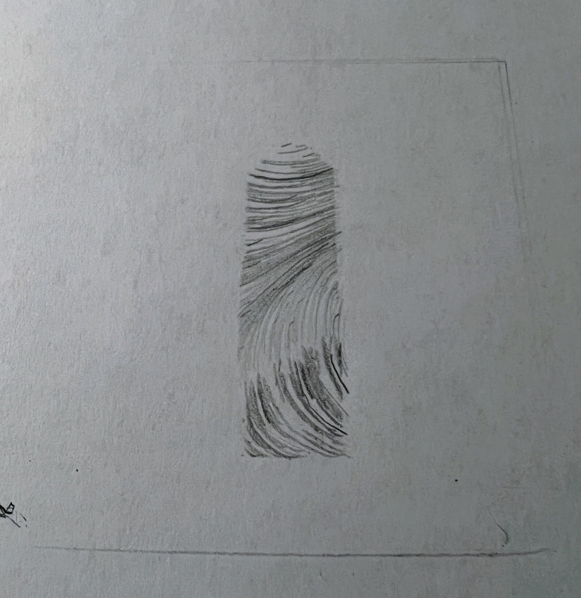

go-pen is a simple generative art framework for pen plotter. It supports
- [X] live-reload/preview of plotter programs
- [X] basic geometries: lines, arcs and bezier curves
- [X] vector fields, including perlin noise generated ones
- [X] PNG output
- [ ] SVG output
- [x] Gcode output

## Try it out
[](https://gitpod.io/#github.com/csweichel/go-pen)

## Getting started
```bash
# install goplot CLI
go install github.com/csweichel/go-pen/cmd/gopen@latest

# create a new sketch
mkdir my-sketches
gopen init my-sketches/hello-world

# start live-preview
gopen preview my-sketches/hello-world/main.go
```

## Generate gcode
All go-pen sketches are self-contained Go programs and can be executed as such. To generate gcode from a sketch just run that sketch:
```
# print the CLI help
go run example/field/main.go --help

# generate gcode
# Tip: inspecting the gcode is easy with https://icesl.loria.fr/webprinter/
go run example/field/main.go --output field.gcode --device gcode --device-opts example/gcode-opts.json
```

Notice the `--device-opts` flag which enables output device configuration. For gcode, [this struct](https://github.com/csweichel/go-pen/blob/b0b0b4c7825d7279268164536038f7da0e98de31/pkg/plot/gcode.go#L10-L15) defines the available options.