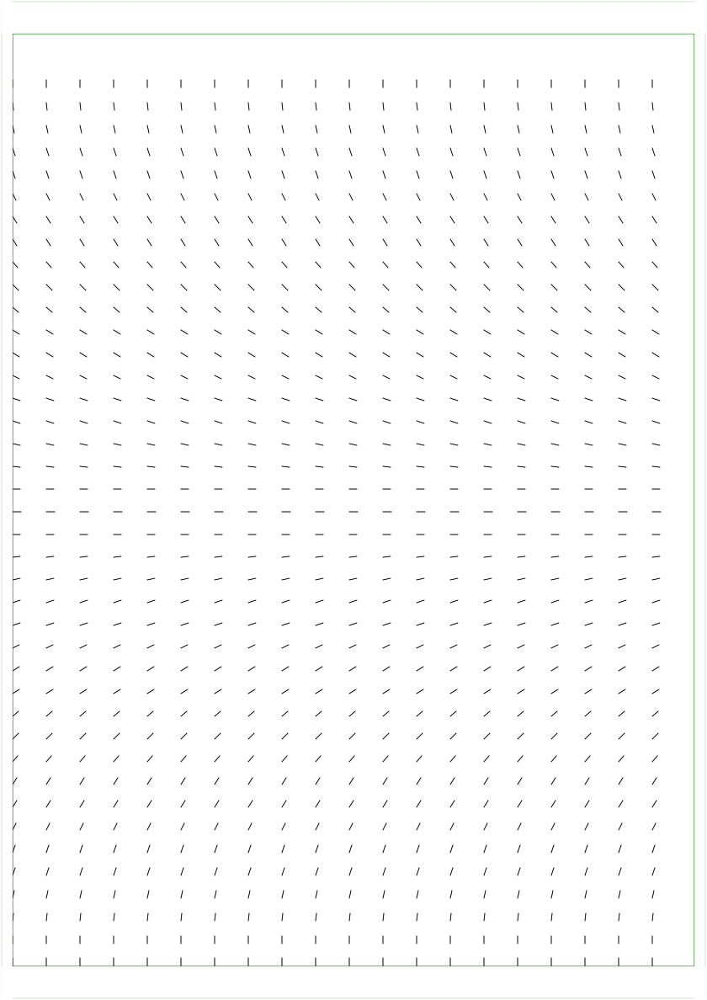

# go-plot
Simple generative art framework for pen plotter

### Ideas
- more basic shapes:
  - rectangles (built from lines)
  - circles (built from bezier curves)
- sampling shapes to lines with a new `Sampleable` interface (`Sample(lineCount int) []Line`)
- intersecting lines with shapes `Stamp(original []Line, shape func(contains XY) bool) []Line`
- [X] vector fields
- CLI
    - `init` which creates a new sketch